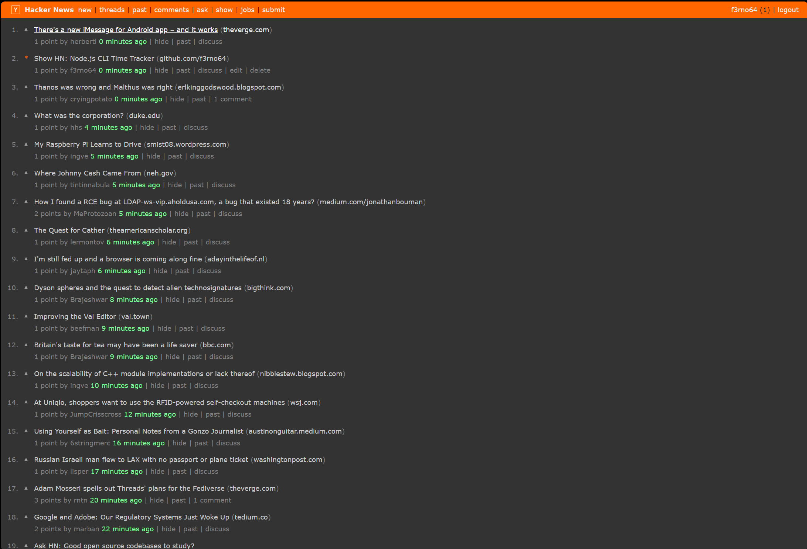

# Minimal Dark Hacker News Style for Stylus

This repository contains the style exported from `Stylus`, providing a darker
HN experience. To use, simply import it in `Stylus` or install it from
[userstyles.world](https://userstyles.world/).

## Preview

## License

Distributed under the **MIT** license. See [LICENSE.md](LICENSE.md) for more information.

## Contributing

1. Fork it
2. Create your feature branch (`git checkout -b my-new-feature`)
3. Commit your changes (`git commit -am 'Add some feature'`)
4. Push to the branch (`git push origin my-new-feature`)
5. Create a new Pull Request
